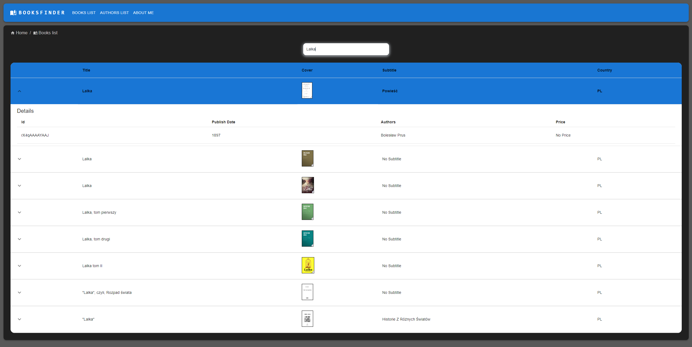
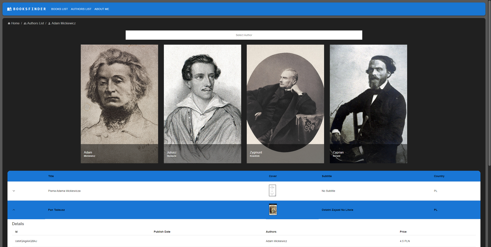

# BookFinder - Google Books API
## Summary
BookFinder is a user-friendly website that utilizes the Google Books API to help you search and discover books. With a vast database of titles, it allows you to explore a wide range of genres, authors, and subjects. BookFinder provides a simple and intuitive interface, enabling you to easily enter book titles to initiate your search. The website returns comprehensive results, displaying relevant book details such as the cover image, synopsis, publication information. Whether you're a bookworm or simply seeking a specific title, BookFinder serves as a valuable tool to explore and find the perfect book for your reading pleasure.

## Key Features
* Use Google Books API
* Search books by title
* Search books by author

## Technologies Used
* Front-end: HTML, CSS, JavaScript, React, Material UI
* API: Google Books
  
# Images

## Books search by title

## Books search by author

